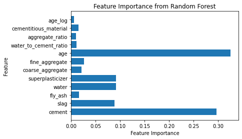
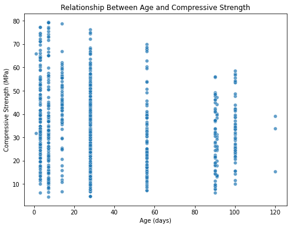
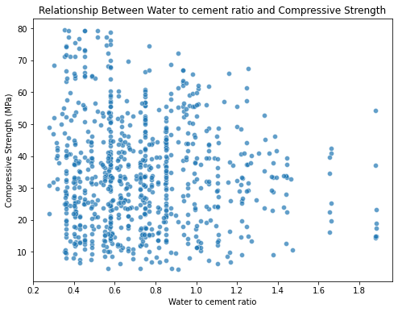

# Predicting Concrete Compressive Strength Using Machine Learning
## By Josh Thyng

## Overview
This project uses machine learning to predict concrete compressive strength, the goal is to optimize mix design and reduce reliance on expensive and time-consuming lab testing. By looking at features like **age**, **cement content**, and **water-to-cement ratio**, we get good insight for creating high-performance concrete mixes.

---

## Features of This Repository
1. **Data Preprocessing**:
    - Scaling and normalization for consistent model performance.
    - Derived features like **water-to-cement ratio** and **cementitious material**.
2. **Model Development**:
    - Tested multiple models, including Linear Regression and Random Forest.
    - Optimized Random Forest for best performance.
3. **Visualization**:
    - Heatmaps, scatterplots, and feature importance charts to explore relationships.
4. **Key Results**:
    - **Optimized Random Forest**:
        - **MAE**: 3.84 MPa
        - **RMSE**: 5.48 MPa

---

## File Structure
- **`material_prediction.ipynb`**: The Jupyter notebook containing all code for data preprocessing, feature engineering, model training, and evaluation.
- **`concrete_data.csv`**: The dataset used in this project.
- **`images/`**: Directory containing visualizations, including scatterplots and heatmaps.

---

## Results
### Key Features Impacting Strength
1. **Age** (32%): Longer curing times lead to stronger concrete.
2. **Cement** (29%): Directly correlated with compressive strength.
3. **Superplasticizer** (9.5%): Improves workability and strength.
4. **Water** (9.2%): Lower water content reduces porosity.
5. **Slag** (8.7%): Contributes to long-term strength.

### Best Mix Design (Predicted by Model)
- **Cement**: 370–400 kg
- **Slag**: 150–200 kg
- **Water-to-Cement Ratio**: 0.4–0.45
- **Superplasticizer**: 10–12 kg
- **Curing Time**: 90 days

---

## Visualizations
### Feature Importance Chart
This chart shows the most important features identified by the Random Forest model.

### Scatterplots
#### Age vs. Compressive Strength
Shows that compressive strength increases with curing time.

#### Water-to-Cement Ratio vs. Strength
Demonstrates the importance of maintaining a low water-to-cement ratio.

---

## References
1. [Scikit-learn Random Forest Documentation](https://scikit-learn.org/stable/modules/generated/sklearn.ensemble.RandomForestRegressor.html)
2. Dataset obtained from public resources.

---

For questions or contributions, feel free to open an issue or submit a pull request.